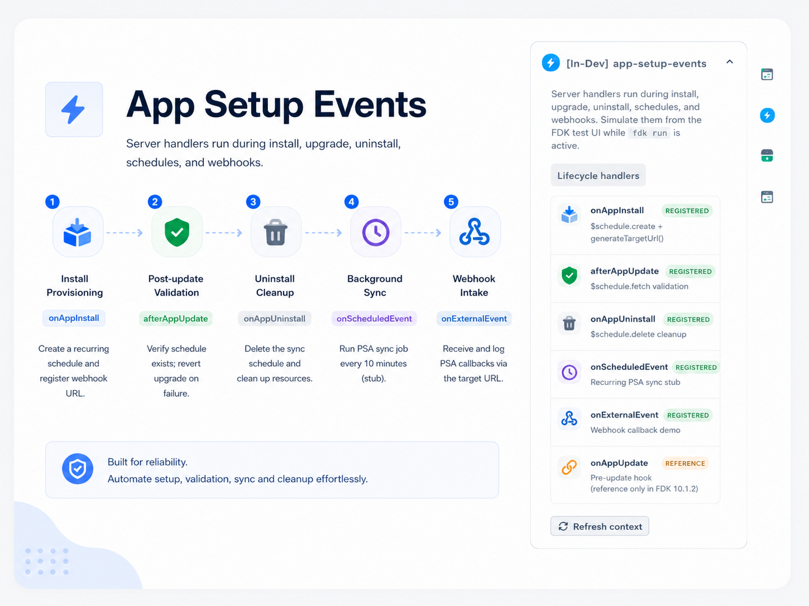

<p align="center">
  
</p>

# App Setup Events — NovaBridge MSP

A Freshworks Platform 3.0 sample app that demonstrates full **app lifecycle** handling — install, update, uninstall, scheduled jobs, and external webhooks — using **App Setup Events**, **Scheduled Events**, and **External Events**.

## Description

Managed service providers must provision integrations reliably on every tenant install. NovaBridge MSP Sync registers recurring sync jobs, exposes webhook URLs, validates upgrades, and cleans up schedules on uninstall — all from serverless handlers registered in `manifest.json`.

### Core Functionality

1. **Install provisioning (`onAppInstall`)** — create a recurring schedule and register an external webhook URL via `generateTargetUrl()`.
2. **Post-update validation (`afterAppUpdate`)** — verify the schedule still exists; revert the upgrade on failure via `renderData({ message })`.
3. **Uninstall cleanup (`onAppUninstall`)** — delete the sync schedule with `$schedule.delete`.
4. **Background sync (`onScheduledEvent`)** — stub PSA sync job triggered every 10 minutes.
5. **Webhook intake (`onExternalEvent`)** — log inbound PSA callbacks at the generated target URL.

## User Interfaces

| Surface | Placement | Behavior |
| --- | --- | --- |
| `app/views/ticket-sidebar.html` | `support_ticket.ticket_sidebar` | Shows PSA tenant ID, lifecycle handler catalog, and ticket context for local dev |

Server-side logic runs in `server/server.js`; the sidebar is for local testing while simulating events in `fdk run`.

## Platform 3.0 Features Used

### 1. App Setup Events

Handlers registered under `modules.common.events`:

| Event | Handler | Purpose |
| --- | --- | --- |
| `onAppInstall` | `onAppInstallHandler` | Schedule + webhook registration |
| `afterAppUpdate` | `afterAppUpdateHandler` | Post-update schedule validation |
| `onAppUninstall` | `onAppUninstallHandler` | Schedule cleanup |
| `onScheduledEvent` | `onScheduledEventHandler` | Recurring sync stub |
| `onExternalEvent` | `onExternalEventHandler` | External webhook callback |

> **Note:** `onAppUpdateHandler` and its test payload are included for reference but cannot be registered in FDK 10.1.2 (`Invalid event: 'onAppUpdate' for module: common`).

### 2. Scheduled Events — `$schedule`

```javascript
await $schedule.create({ name: 'syncSchedule', schedule_at: '...', repeat: { time_unit: 'minutes', frequency: 10 } });
await $schedule.fetch({ name: 'syncSchedule' });
await $schedule.delete({ name: 'syncSchedule' });
```

### 3. External Events — `generateTargetUrl()`

Install handler generates a webhook URL for PSA systems to push ticket updates back into Freshworks.

### 4. Crayons UI Components

| Component | Usage |
| --- | --- |
| `<fw-label>` | Lifecycle handler section title |
| `<fw-button>` | Refresh tenant and ticket context |
| `<fw-inline-message>` | Hint when PSA tenant ID is not configured |

## Project Structure

```
├── app/
│   ├── views/
│   │   └── ticket-sidebar.html   # Dev sidebar UI
│   ├── scripts/
│   │   ├── ticket-sidebar.js
│   │   └── lib/lifecycle-catalog.js
│   └── styles/
│       ├── common.css
│       ├── ticket-sidebar.css
│       └── images/
├── config/
│   └── iparams.json              # PSA tenant + API key (demo)
├── server/
│   ├── server.js                 # Lifecycle event handlers
│   └── test_data/                # Payloads for fdk run simulation
├── tests/
│   ├── server.test.js
│   └── ticket-sidebar.test.js
├── manifest.json
├── usecase.md
└── README.md
```

## Prerequisites

- [Freshworks CLI (FDK)](https://developers.freshworks.com/docs/app-sdk/v3.0/support_ticket/basic-dev-tools/freshworks-cli/) v10.1.2 or later
- Node.js v24.x
- A Freshdesk trial account

Enable global apps before local development:

```bash
fdk config set global_apps.enabled true
```

## Installation Parameters

This sample does **not** connect to a real PSA. The iparams are fictional NovaBridge identifiers so install and schedule payloads look like production integrations.

| Field | Required | What to enter |
| --- | --- | --- |
| **PSA Tenant ID** | No (default provided) | Any tenant slug string, e.g. `tenant-acme-001`. Stored on the recurring schedule as `data.tenant` during `onAppInstall` and logged when `onScheduledEvent` runs. Use one ID per Freshdesk account in a real MSP app. |
| **PSA API Key** | No | Any placeholder for local dev, e.g. `demo-key`. Marked secure — not returned to the frontend. Stub handlers do not call an external PSA API. |

The sidebar reads **PSA Tenant ID** via `client.iparams.get()` so you can confirm the value you entered at install.

Example test payload (`server/test_data/onAppInstall.json`):

```json
"iparams": {
  "psaTenantId": "tenant-acme-001",
  "psaApiKey": "demo-key"
}
```

## Local Development

1. Clone the repository:
   ```bash
   git clone <repo-url>
   cd app-setup-events-samples
   ```

2. Install dependencies, validate, and run:
   ```bash
   npm install
   fdk validate
   fdk run
   ```

3. At `http://localhost:10001/custom_configs`, accept the default **PSA Tenant ID** or enter your own demo slug. **PSA API Key** can be any placeholder.

4. In the FDK test UI, pick an event (`onAppInstall`, `afterAppUpdate`, `onAppUninstall`, `onScheduledEvent`, `onExternalEvent`) and invoke the matching handler. Test payloads live in `server/test_data/`.

5. Open a Freshdesk ticket with `?dev=true` to confirm the sidebar shows your tenant ID and ticket context:
   ```
   https://your-domain.freshdesk.com/a/tickets/1?dev=true
   ```

> Admins must click **Update** in Manage Apps when testing `afterAppUpdate` — tenants are not auto-upgraded.

Reset local installation parameters when re-testing install flows:

```bash
rm .fdk/store.sqlite
fdk run
```

## Testing

```bash
npm run fdk-unit-test
```

## Key Learnings

1. **Install blocking** — call `renderData({ message })` from `onAppInstall` to prevent a broken integration from going live.
2. **Upgrade safety** — `afterAppUpdate` can revert to the previous version if post-update validation fails.
3. **Cleanup on uninstall** — always delete schedules and revoke external registrations in `onAppUninstall`.
4. **Tenant scoping** — persist the PSA tenant ID on schedule `data` so recurring jobs know which external tenant to sync.

## Resources

- [App setup events](https://developers.freshworks.com/docs/app-sdk/v3.0/common/app-settings/app-setup-events/)
- [Scheduled events](https://developers.freshworks.com/docs/app-sdk/v3.0/common/serverless-apps/scheduled-events/)
- [External events](https://developers.freshworks.com/docs/app-sdk/v3.0/common/serverless-apps/external-events/)
